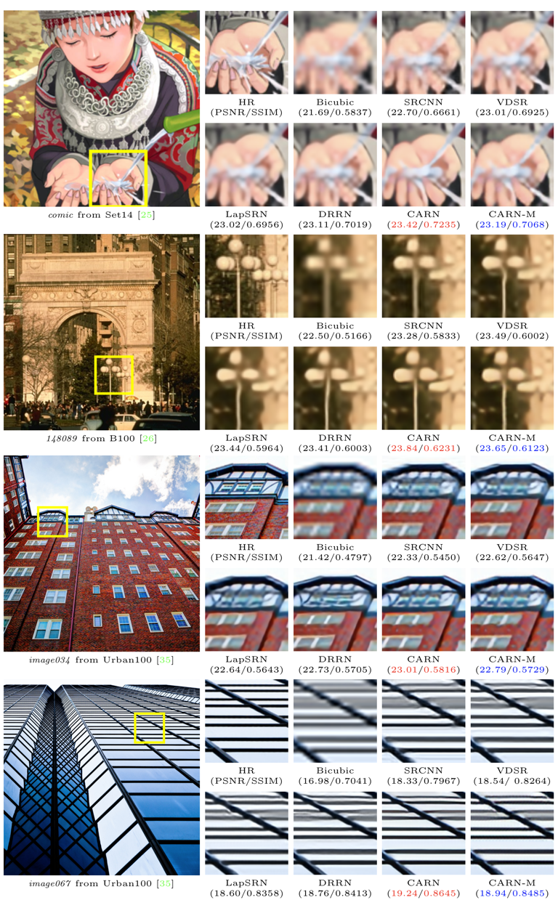

# Fast, Small and Accurate Super-Resolution with Cascading Residual Network
Namhyuk Ahn, Byungkon Kang, Kyung-Ah Sohn

### Introduction
The Cascading Residual Network (CARN) and CARN-Mobile (CARN-M) are super-resolution models that implements a *cascading mechanism* upon a residual network. By doing so, our models achieve comparable performance with state-of-the-art methods with only a very few operations.

### Requirements
- Python 3
- [PyTorch](https://github.com/pytorch/pytorch) (0.3.0), [torchvision](https://github.com/pytorch/vision)
- Numpy, Scipy
- Pillow, Scikit-image
- h5py
- importlib

### Dataset
We use DIV2K dataset for training and test on Set5, Set14, B100 and Urban100 dataset. Here are following steps to prepare datasets.

1. Download [DIV2K](https://data.vision.ee.ethz.ch/cvl/DIV2K) and unzip on `dataset` directory as below.
  ```
  dataset
  └── DIV2K
      ├── DIV2K_train_HR
      ├── DIV2K_train_LR_bicubic
      ├── DIV2K_valid_HR
      └── DIV2K_valid_LR_bicubic
  ```
2. To accelerate training, we first convert training images as h5 format. Simply run below code (h5py module has to be installed).
```shell
$ cd datasets && python div2h5.py
```
3. Other benchmark datasets can be downloaded in [here](https://drive.google.com/file/d/1JJFKMRdOF4DqZd1kwDRrPKvSKnmqWjed/view?usp=sharing). Same as DIV2K, place all the datasets in `dataset` directory.

### Test Pre-trained Models
We provide pre-trained models in `checkpoint` directory. To test CARN on benchmark dataset:
```shell
$ python carn/sample.py --model=carn \
                        --test_data_dir=d... \
                        --scale=4 \
                        --ckpt_path=checkpoint/carn.pth \
                        --sample_dir=sample
```
and for CARN-M,
```shell
$ python carn/sample.py --model=carn_m \
                        --test_data_dir=... \
                        --scale=4 \
                        --group=4 \
                        --reduce_upsample \
                        --ckpt_path=checkpoint/carn_m.pth \
                        --sample_dir=sample \
```
To test on DIV2K dataset, set `test_data_dir` argument as `dataset/DIV2K/DIV2K_valid`, and `dataset/other_dataset_dir` for other datasets.

Or, we also provide our results on four benchmark dataset (Set5, Set14, B100 and Urban100) in [here](https://drive.google.com/file/d/1RGio4rgo1f8vjUJlp891gRqY8Fov40hD/view?usp=sharing).

### Training Models
Here is our default setting to train CARN and CARN-M. Note: We only ran in TITAN X or 1080ti. If OOM error occurs, please decrease batch size.
```shell
# For CARN
python carn/train.py --patch_size=48 \
                     --batch_size=32 \
                     --max_steps=500000 \
                     --decay=300000 \
                     --model=carn \
                     --ckpt_name=carn \
                     --scale=0 \
                     --num_gpu=1
# For CARN-M
python carn/train.py --patch_size=48 \
                     --batch_size=32 \
                     --max_steps=500000 \
                     --decay=300000 \
                     --model=carn_m \
                     --ckpt_name=carn_m \
                     --group=4 \
                     --reduce_upsample \
                     --scale=0 \
                     --num_gpu=1
```
In the `--scale` argument, [2, 3, 4] is for single-scale training and 0 for multi-scale learning. `--group` represents group size of group convolution inside of efficient residual block. `--reduce_upsample` means use 1x1 convolution instead of 3x3 in the upsampling layer.

### Results
Quantitative evaluation of state-of-the-art SR algorithms


Visual qualitative comparison on 4× scale datasets.


### Citation
