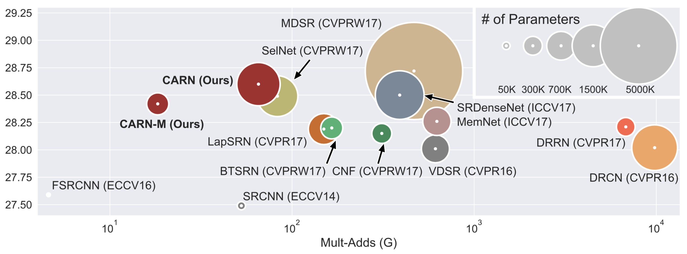
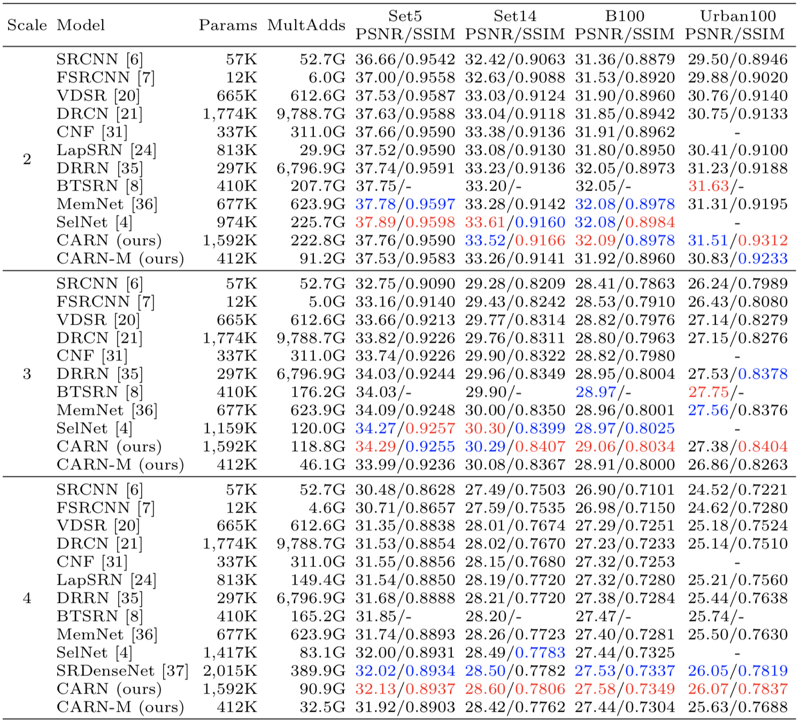

# Fast, Accurate, and Lightweight Super-Resolution with Cascading Residual Network
Namhyuk Ahn, Byungkon Kang, Kyung-Ah Sohn.<br>
European Conference on Computer Vision (ECCV), 2018. 
[[arXiv](https://arxiv.org/abs/1803.08664)]



### Abstract
In recent years, deep learning methods have been successfully applied to single-image super-resolution tasks. Despite their great performances, deep learning methods cannot be easily applied to real-world applications due to the requirement of heavy computation. In this paper, we address this issue by proposing an accurate and lightweight deep learning model for image super-resolution. In detail, we design an architecture that implements a cascading mechanism upon a residual network. We also present a variant model of the proposed cascading residual network to further improve efficiency. Our extensive experiments show that even with much fewer parameters and operations, our models achieve performance comparable to that of state-of-the-art methods.

### FAQs
1. Can't reproduce PSNR/SSIM as recorded in the paper: See [issue#6](https://github.com/nmhkahn/CARN-pytorch/issues/6)

### Requirements
- Python 3
- [PyTorch](https://github.com/pytorch/pytorch) (0.4.0), [torchvision](https://github.com/pytorch/vision)
- Numpy, Scipy
- Pillow, Scikit-image
- h5py
- importlib

### Dataset
We use DIV2K dataset for training and Set5, Set14, B100 and Urban100 dataset for the benchmark test. Here are the following steps to prepare datasets.

1. Download [DIV2K](https://data.vision.ee.ethz.ch/cvl/DIV2K) and unzip on `dataset` directory as below:
  ```
  dataset
  └── DIV2K
      ├── DIV2K_train_HR
      ├── DIV2K_train_LR_bicubic
      ├── DIV2K_valid_HR
      └── DIV2K_valid_LR_bicubic
  ```
2. To accelerate training, we first convert training images to h5 format as follow (h5py module has to be installed).
```shell
$ cd datasets && python div2h5.py
```
3. Other benchmark datasets can be downloaded in [Google Drive](https://drive.google.com/drive/folders/1t2le0-Wz7GZQ4M2mJqmRamw5o4ce2AVw?usp=sharing). Same as DIV2K, please put all the datasets in `dataset` directory.

### Test Pretrained Models
We provide the pretrained models in `checkpoint` directory. To test CARN on benchmark dataset:
```shell
$ python carn/sample.py --model carn \
                        --test_data_dir dataset/<dataset> \
                        --scale [2|3|4] \
                        --ckpt_path ./checkpoint/<path>.pth \
                        --sample_dir <sample_dir>
```
and for CARN-M,
```shell
$ python carn/sample.py --model carn_m \
                        --test_data_dir dataset/<dataset> \
                        --scale [2|3|4] \
                        --ckpt_path ./checkpoint/<path>.pth \
                        --sample_dir <sample_dir> \
                        --group 4
```
We provide our results on four benchmark dataset (Set5, Set14, B100 and Urban100). [Google Drive](https://drive.google.com/drive/folders/1R4vZMs3Adf8UlYbIzStY98qlsl5y1wxH?usp=sharing)

### Training Models
Here are our settings to train CARN and CARN-M. Note: We use two GPU to utilize large batch size, but if OOM error arise, please reduce batch size.
```shell
# For CARN
$ python carn/train.py --patch_size 64 \
                       --batch_size 64 \
                       --max_steps 600000 \
                       --decay 400000 \
                       --model carn \
                       --ckpt_name carn \
                       --ckpt_dir checkpoint/carn \
                       --scale 0 \
                       --num_gpu 2
# For CARN-M
$ python carn/train.py --patch_size 64 \
                       --batch_size 64 \
                       --max_steps 600000 \
                       --decay 400000 \
                       --model carn_m \
                       --ckpt_name carn_m \
                       --ckpt_dir checkpoint/carn_m \
                       --scale 0 \
                       --group 4 \
                       --num_gpu 2
```
In the `--scale` argument, [2, 3, 4] is for single-scale training and 0 for multi-scale learning. `--group` represents group size of group convolution. The differences from previous version are: 1) we increase batch size and patch size to 64 and 64. 2) Instead of using `reduce_upsample` argument which replace 3x3 conv of the upsample block to 1x1, we use group convolution as same way to the efficient residual block.

### Results
**Note:** As pointed out in [#2](https://github.com/nmhkahn/CARN-pytorch/issues/2), previous Urban100 benchmark dataset was incorrect. The issue is related to the mismatch of the HR image resolution from the original dataset in x2 and x3 scale. We correct this problem, and provided dataset and results are fixed ones.




### Citation
```
@article{ahn2018fast,
  title={Fast, Accurate, and Lightweight Super-Resolution with Cascading Residual Network},
  author={Ahn, Namhyuk and Kang, Byungkon and Sohn, Kyung-Ah},
  journal={arXiv preprint arXiv:1803.08664},
  year={2018}
}
```
